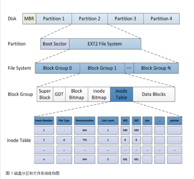
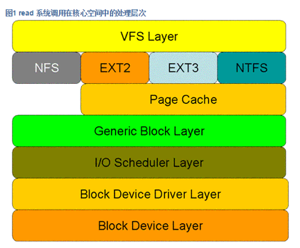
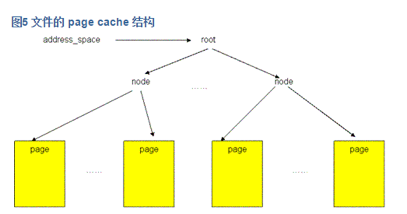
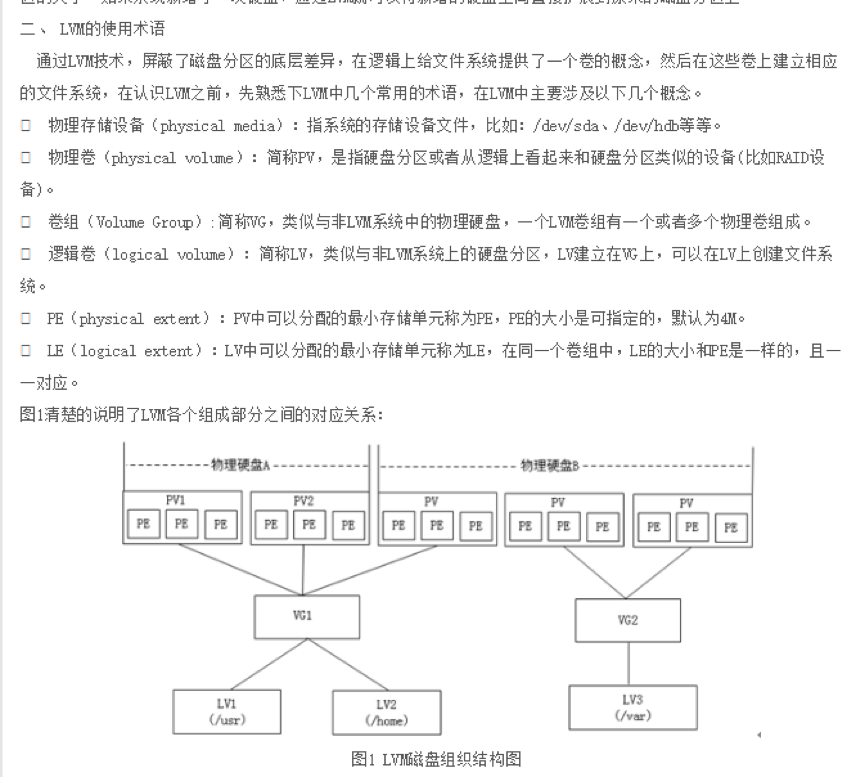


# 文件系统

概念：是操作系统的一部分，用来管理磁盘空间，向外提供操纵接口。比如fread，fwrite，fopen等系统调用就是文件系统提供的功能。

作用：管理用户的逻辑文件，替用户保存逻辑文件到存储块的映射。并提供缓存机制，做到存取速度快，存储空间利用率高，数据安全性好。

>NFS（Network File System）即网络文件系统  
>NTFS (New Technology File System)  
>FAT是文件配置表（英语：File Allocation Table，首字母缩略字：FAT）  
>EXT4是第四代扩展文件系统（英语：Fourth extended filesystem，缩写为 ext4）

文件系统中存储的最小单位是块（Block）Ext2文件系统将整个分区划成若干个同样大小的块组（Block Group），如图1所示，每个块组都由以下部分组成：



## 1. Super Block（超级块）
描述整个分区的文件系统信息，例如块大小、文件系统版本号、上次mount的时间等等。超级块在每个块组的开头都有一份拷贝。

先介绍几个结构体：

### file结构体：
存在于task_struct的 文件描述符表 的每个元素指向的内存中。fd为文件描述符表的索引。文件描述符表  是个指针数组，每个元素指向一个file结构体。

文件结构体代表一个打开的文件，系统中的每个打开的文件在内核空间都有一个关联的 struct file。它由内核在打开文件时创建，并传递给在文件上进行操作的任何函数。在文件的所有实例都关闭后，内核释放这个数据结构。并且一个文件即使是在一个进程中多次打开，也会存在多个file结构。（http://blog.sina.com.cn/s/blog_7943319e01018m3w.html）

为什么要设置file结构体？
	因为linux下，文件是共享的。意味着多个进程对这个文件的读写有着不同的偏移量。首先文件偏移量不能放在inode，因为多个进程可能会共享一个inode。所以只能创建一个中间结构struct file 来保存文件偏移量。即使是这样，父进程和子进程还是有这方面问题的矛盾。因为子进程会继承父进程打开的文件，也就是说，子进程的文件描述符表和父进程的文件描述符表指向的是同一组file结构（仅仅增加了file结构体中的引用计数）。所以，子进程对文件偏移量的操作必然会影响到父进程。所以，一般在父进程和子进程之间需要同步机制或者在父子进程中分别关闭不用的文件，以免互相影响。(详细见http://woshiniezhenhua.blog.163.com/blog/static/191376928201291344920408/      http://www.tuicool.com/articles/I3AZF3）		
几个比较重要的元素：

1. 	f_flag：文件标志， O_RDONLY, O_NONBLOCK, 和 O_SYNC. 驱动应当检查O_NONBLOCK 标志来看是否是请求非阻塞操作。
2. f_count：引用计数
3. f_pos：文件偏移量
4. f_dentry：关联到文件的目录入口( dentry )结构. 设备驱动编写者正常地不需要关心 dentry 结构, 除了作为 filp->f_dentry->d_inode 存取 inode 结构.

说道这里，文件是怎么共享的？
### 静态共享和动态共享
静态共享分为硬链接和软链接。

二者的区别是，硬链接修改文件目录项，把两个不同名的文件的inode指针指向同一个inode。
而软链接则是使用另外一个独立的文件，只不过文件内容是需要指向文件的路径名。然后使用某个系统调用，利用路径名打开指向的文件，实现共享。

- 硬链接的优点是简单，但是不能跨越文件系统。
- 软链接的优点是可以跨越文件系统，但是要占用额外的空间和inode，而且容易形成死链的情况。
- 最重要的是，无论是硬链接还是软连接，都属于静态链接，他们最终映射到同一个inode，但是两个进程持有不同的file结构，也就是说，静态链接不能实现共享偏移量。
动态共享
	
为什么会出现动态共享，是为了解决上面说的不能共享读写偏移量的问题。现实生活中，有两种需求。一种是需要共享读写指针，另一种是不需要共享。为了实现前者，linux系统提出了系统打开文件表的概念。
主要是将一些需要被共享的file结构体统一放在系统打开文件表中。如果两个进程希望共享文件读写指针，则使二者的文件描述符表指向系统打开文件表中的同一个file结构体。而如果不需要共享，则指向不同的系统打开文件表即可。

dentry结构体，只需要知道其中有指向inode的指针即可

open函数的执行过程（http://blog.chinaunix.net/uid-25968088-id-3426026.html）
（1）task_sruct中保存有该进程可以使用的但是未使用的文件描述符，先通过某个函数获取一个文件描述符。
（2）在task_struct的文件描述符表中文件描述符对应的位置初始化一个file指针，并分配一个全新的file结构体。
（3）利用传入的参数查找或者建立dentry，并绑定inode，至此，file结构的初始化到此为止。
（4）建立fd与file结构的关系，返回fd、
网络教程：

1.  找到一个本进程没有使用的文件描述符fd（int型）
2.  分配一个全新的struct file结构体
3.  根据传人的pathname查找或建立对应的dentry
4.  建立fd到这个struct file结构体的联系


read函数的执行过程（http://blog.csdn.net/lwj103862095/article/details/38518069）



图1显示了 read 系统调用在核心空间中所要经历的层次模型。从图中看出：对于磁盘的一次读请求，首先经过虚拟文件系统层（vfs layer），其次是具体的文件系统层（例如 ext2），接下来是 cache 层（page cache 层）、通用块层（generic block layer）、IO 调度层（I/O scheduler layer）、块设备驱动层（block device driver layer），最后是物理块设备层（block device layer）

1. 虚拟文件系统层的作用：屏蔽下层具体文件系统操作的差异，为上层的操作提供一个统一的接口。正是因为有了这个层次，所以可以把设备抽象成文件，使得操作设备就像操作文件一样简单。
2. 在具体的文件系统层中，不同的文件系统（例如 ext2 和 NTFS）具体的操作过程也是不同的。每种文件系统定义了自己的操作集合。关于文件系统的更多内容，请参见参考资料。
3. 引入 cache 层的目的是为了提高 linux 操作系统对磁盘访问的性能。 Cache 层在内存中缓存了磁盘上的部分数据。当数据的请求到达时，如果在 cache 中存在该数据且是最新的，则直接将数据传递给用户程序，免除了对底层磁盘的操作，提高了性能。
4. 通用块层的主要工作是：接收上层发出的磁盘请求，并最终发出 IO 请求。该层隐藏了底层硬件块设备的特性，为块设备提供了一个通用的抽象视图。
5. IO 调度层的功能：接收通用块层发出的 IO 请求，缓存请求并试图合并相邻的请求（如果这两个请求的数据在磁盘上是相邻的）。并根据设置好的调度算法，回调驱动层提供的请求处理函数，以处理具体的 IO 请求。
6. 驱动层中的驱动程序对应具体的物理块设备。它从上层中取出 IO 请求，并根据该 IO 请求中指定的信息，通过向具体块设备的设备控制器发送命令的方式，来操纵设备传输数据。
7. 设备层中都是具体的物理设备。定义了操作具体设备的规范。

### 相关的内核数据结构：

- Dentry ： 联系了文件名和文件的 i 节点  
- inode ： 文件 i 节点，保存文件标识、权限和内容等信息  
- file ： 保存文件的相关信息和各种操作文件的函数指针集合  
- file_operations ：操作文件的函数接口集合  
- address_space ：描述文件的 page cache 结构以及相关信息，并包含有操作 page cache 的函数指针集合  
- address_space_operations ：操作 page cache 的函数接口集合  
- bio ： IO 请求的描述  



图5显示了一个文件的 page cache 结构。文件被分割为一个个以 page 大小为单元的数据块,这些数据块（页）被组织成一个多叉树（称为 radix 树）。此树的层次可以从0层到6层，所支持的文件大小从0字节到16 T 个字节。树的根节点指针可以从和文件相关的 address_space 对象（该对象保存在和文件关联的 inode 对象中）中取得


（1）产生系统调用，in0x80，根据中断号，在中断向量表中找到read函数的入口地址，将cpu执行权给read系统调用。
（2）read通过传入的fd，取出file结构体中的文件偏移量，并通过dentry找到inode结构。
（3）inode中存放着该文件对应的page cache的结构以及相关信息，并且有一组操纵page cache结构的函数指针。read在真正向底层发送读取信息之前，会先操纵page cache 来查看 
其中有没有需要读取的页。如果有，有专门函数讲page chache 中的数据拷贝到用户空间，read调用链到此结束。如果没有，lock计算出的页，则向下层发送添页请求，当再次lock成功时，说明数据已经在page cache 中了，拷贝到用户空间，结束。


# 文件操作的一般步骤：
1. 根据路径名找到对应的dentry结构，并绑定inode。
2. 根据dentry找到inode
3. 根据inode中的某个数组获得对应文件的信息存放在哪些数据块上。
4. 调用文件系统函数向更下一层发送命令，从而从磁盘读取数据。
# page cache机制：
	linux访问文件的方式分为直接IO和非直接IO两大类。其中，非直接IO就会用到page cache。上层程序写的数据先写到page cache，再有内核线程定期刷到磁盘。用户程序需要读的数据，先读到page cache，再从page cache拷贝到用户空间。

# ext2文件系统
ext2文件系统会将磁盘空间格式化为几个部分，分别保存

1. MBR ：MBR的作用是把操作系统自己的引导程序读入内存并跳转到操作系统的引导程序。本身与任何操作系统无关。MBR前446字节是主引导记录，后64字节是分区表。最后2个字节是结束标志。（具体我讲）
2. inode信息
3. 真正的数据

但是如果一个文件系统容量很大，那么将所有的inode和block都放在一起管理很不明智的。所以便有了块组的概念。
	
超级块描述了整个文件系统的信息，比如大小，inode/block的总数,已使用数量和剩余数量，其他文件系统的信息。
block块组描述符则也类似，描述了一个块组的信息，例如在这个块组中从哪里开始是inode表，从哪里开始是数据块，空闲的inode和数据块还有多少个等等。块描述符和超级块一样，在每个块组开头都有一份拷贝，系统一般只使用到第0组的拷贝。一个块组中的所有inode组成了一个inode表。这里还有块位图，inode位图的概念。
# lvm磁盘组织结构图 


	
